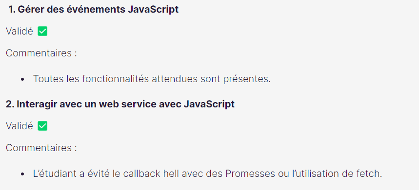
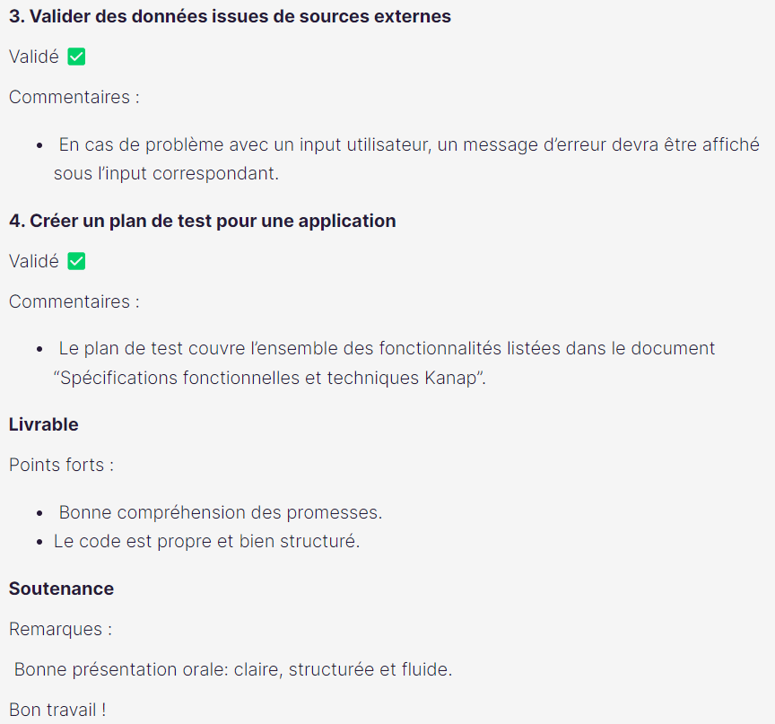

# Kanap - Projet d'études

- Dans le cadre de mes études de développeur web
- Site de vente en ligne où j'ai mis en place l'affichage et la commande des articles en **Javascript** à partir du front-end et de l'API

## Instructions

- Lancer le projet à partir d'un éditeur de code avec un serveur local à l'aide de node.js

## Contexte

- Consignes : https://course.oc-static.com/projects/DWJ_FR_P5/DW+P5+-+Specifications+fonctionnelles.pdf
- Maquette de départ : https://github.com/OpenClassrooms-Student-Center/P5-Dev-Web-Kanap

## Évaluation

- Projet validé
- Commentaires :
  
  
